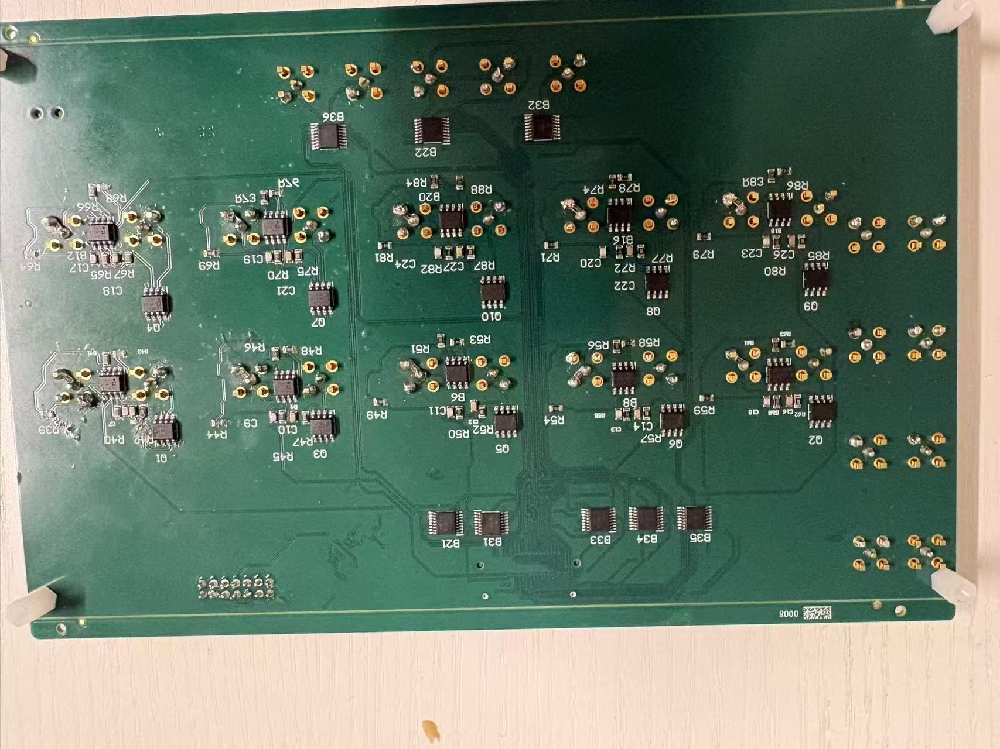
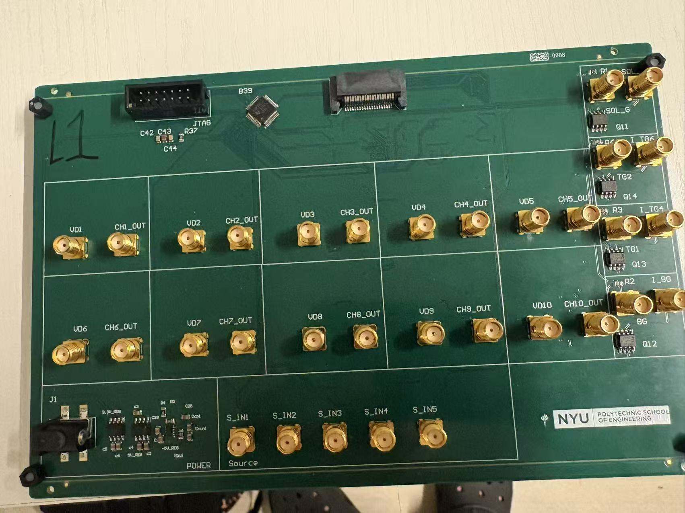
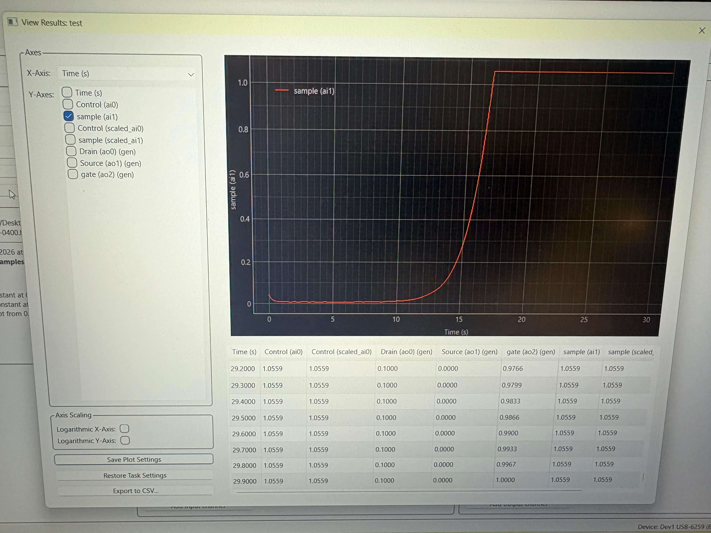
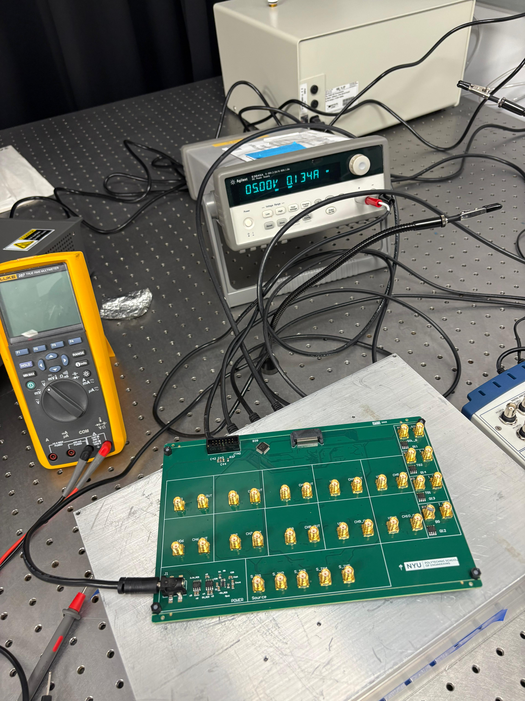
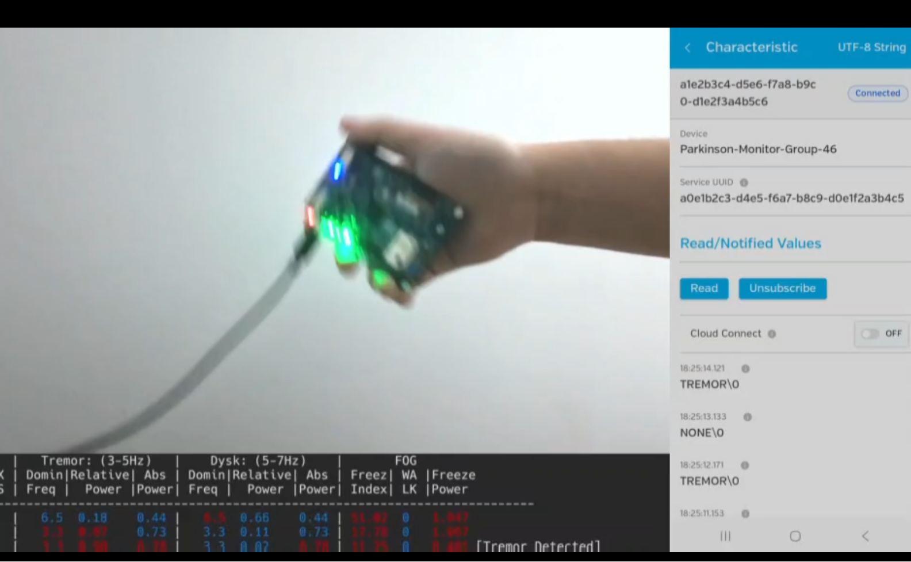

## 1、FPGA AI Kernel Accelerator (Sobel Edge Detection)

My Github repo https://github.com/Jason1790213836/Sobel-Edge-Detection-Accelerator-on-FPGA

Hardware Design Related Repo: https://github.com/Jason1790213836/hwdesign

------

### Overview

- Built a **streaming Sobel kernel on FPGA (PYNQ-Z2)** using Vitis HLS
- Designed end-to-end pipeline: **DDR → AXI DMA → AXI-Stream → Kernel → DMA → DDR**
- Achieved **II=1 (1 pixel/cycle)** → ~**100–125M pixels/s throughput**

------

### Architecture

- **2-line buffer + 3×3 sliding window** (no full-frame buffering)
- **Streaming AXI-Stream pipeline** for continuous dataflow
- Compute + memory fully overlapped

------

### Optimizations

- Pipeline (II=1) for maximum throughput
- Reduced arithmetic **32-bit → 12-bit**
- Replaced multipliers with **shift operations**
- Used **dual-port BRAM** for line buffers
- Balanced computation to reduce critical path

------

### Debug & Performance

- Fixed DMA mismatch and frame boundary issues → **artifact-free output**
- Resolved timing bottleneck (~ -0.7ns slack) via pipeline + restructuring
- Achieved stable operation at **100–125 MHz**, near 150 MHz target

------

### Performance

| Metric     | Value                     |
| ---------- | ------------------------- |
| Throughput | 1 pixel / cycle           |
| Frequency  | 100–125 MHz               |
| Peak Rate  | ~100–125M pixels/s        |
| Speedup    | **>100× vs CPU baseline** |

------


## 2、BIOCHIP Design Project

NYU Tandon | Elisa Riedo PicoForce Lab

github repo link:https://github.com/Jason1790213836/Elisa_Riedo_Lab_BIOCHIP_Design/

------

### Overview

This project focuses on the design and validation of a **multi-layer PCB system for bio-sensing IC characterization**, integrating hardware design, embedded control, and automated measurement workflows.

The system supports:

- Multi-channel chip testing
- Precise voltage routing and switching
- Automated IV characterization using Python + Keithley instruments

This work is part of my research experience at NYU, where I contributed to **PCB design, embedded interfacing, and lab automation**.

------

### 🔷 Big Board (Core System)

### 📌 Functionality

The **Big Board** is the central platform for biochip testing and signal routing.

It is designed to:

- Distribute multiple voltage rails to bio-sensing ICs
- Support **multi-channel switching** via TMUX1109 multiplexers
- Enable **drain-gate / source-gate characterization**
- Interface with external instruments (Keithley SMU)

### ⚙️ Key Features

- 6-layer PCB for signal integrity and power stability
- Multiplexer-based channel selection for scalable testing
- Modular interface for different chip configurations
- Designed and verified using Altium Designer

### 🧠 My Contribution

- Full-stack PCB design: schematic → layout → verification
- Debugged **power anomalies and open-circuit issues** using DMM
- Fixed chip-selection mismatch issues in hardware
- Integrated with embedded + Python test system

------

### 📷 Big Board

 

------

## 🔷 Measurement & Automation

The system integrates with a **Python-based control interface**:

- Automated voltage sweep (IV curves)
- Real-time data acquisition
- Instrument control via UART / JTAG
- GUI-based workflow for lab testing

### 📷 IV Curve Measurement

 



------

## 🔷 Small Board

### 📌 Description

- Big board same functionality but without the current sensing amplification.

------

## 🔷 Pogo Board

### 📌 Description

- 4-layer pogo interface board

- Provides reliable electrical contact to bare dies / chips

- Designed for repeated testing and modular connection

  

## 3、⚙️ Real-Time Embedded System (IMU + FFT)

Video: https://github.com/Jason1790213836/ECEGY6483-25Fall/blob/main/intro.mp4

Github link:https://github.com/Jason1790213836/ECEGY6483-25Fall/

**Platform:** STM32 B-L475E-IOT01A
 **Language:** C
 **Technologies:** RTOS, IMU (Accelerometer + Gyroscope), FFT, BLE

------

### 📌 Overview

Developed a **real-time embedded system** for detecting tremor, dyskinesia, and freezing-of-gait using on-board IMU sensors.
 The system processes continuous motion data through a **low-latency signal processing pipeline** and provides real-time feedback via BLE and on-board indicators.



------

### ⚙️ System Architecture

```
IMU Sensor (I2C, interrupt-driven)
        ↓
   ISR (data ready)
        ↓
   Ring Buffer (producer)
        ↓
   FFT Task (consumer)
        ↓
 Feature Extraction / Classification
        ↓
   BLE Task + LED Feedback
```

------

### 🔧 Key Features

**Real-Time Data Pipeline**

- Implemented a **3-second sliding window** for continuous motion analysis
- Designed a streaming-style processing flow for low-latency response

**RTOS-Based Firmware Design**

- Separated system into multiple tasks:
  - Sensor acquisition task
  - FFT processing task
  - Classification / analysis task
  - BLE communication task
- Used **task prioritization** to guarantee timing constraints

**Efficient ISR-to-Task Communication**

- Designed a **producer–consumer model**
- Used:
  - **Ring buffer** for ISR-safe data buffering
  - **Mail queues** for inter-task data transfer
- Ensured **data integrity and deterministic behavior**

**Signal Processing (FFT)**

- Applied FFT on IMU data to extract frequency-domain features
- Enabled detection of tremor patterns based on frequency characteristics

**Wireless Communication**

- Implemented **multi-characteristic BLE interface**
- Streamed real-time classification results to external devices

------

### 🚀 Technical Highlights

- Interrupt-driven sensor acquisition (no polling, low CPU overhead)
- Lock-free or minimal-lock data structures for ISR safety
- Real-time scheduling with predictable latency
- Efficient memory usage under embedded constraints
- Modular firmware design for scalability

------

### 📊 What I Learned

- Designing **real-time embedded pipelines** under tight resource constraints
- Managing **concurrency between ISR and RTOS tasks**
- Implementing **efficient data buffering strategies** (ring buffer, queues)
- Bridging **signal processing algorithms with embedded firmware**

------

### 🔮 Future Improvements

- Integrate **hardware DSP acceleration (CMSIS-DSP)**
- Add **on-device ML classification (TinyML / TFLite Micro)**
- Optimize power consumption for wearable deployment


